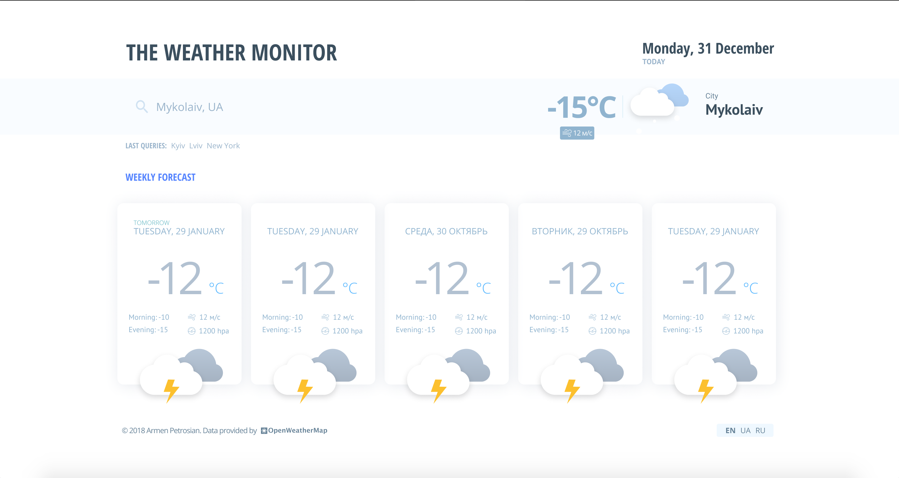

<!--  -->


## Weather forecast application



### Features
- The application shows current **temperature**, **wind speed** and **pressure** for selected location.
- Kyiv, UA selected by default.
- Use search form to find weather for specific city. 
- The app saves 10 recent search queries.
- Display weather forecast up to next 5 days (because of [OpenWeatherMap](https://openweathermap.org/api) restrictions we sometimes can get data for less days)

View [**DEMO here**](https://arnie.site/weather-forecast/).

### Technical info

* Building with **Webpack 4** using configuration written from scratch
* Separated **Production** and **Development** configs
* ES6+ support with **Babel 7**
* **React 16.x** view components
* **CSS Modules** approach for component styling (with **SCSS** as pre-processor)
* **Redux**-based state management
* Code style controlled by Airbnb **ESlint** config, and a few additional rules and overrides.
* Internationalization with **i18next** library

#### To *start* the project use the following instructions:
```
npm install
npm run start
```
Then project will be running on [http://localhost:9000]()

#### To *build*:
```
npm install
npm run build
# npm install -g local-web-server
ws -d dist
```
